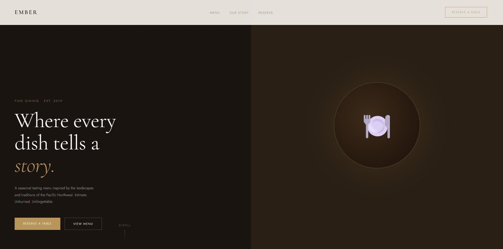
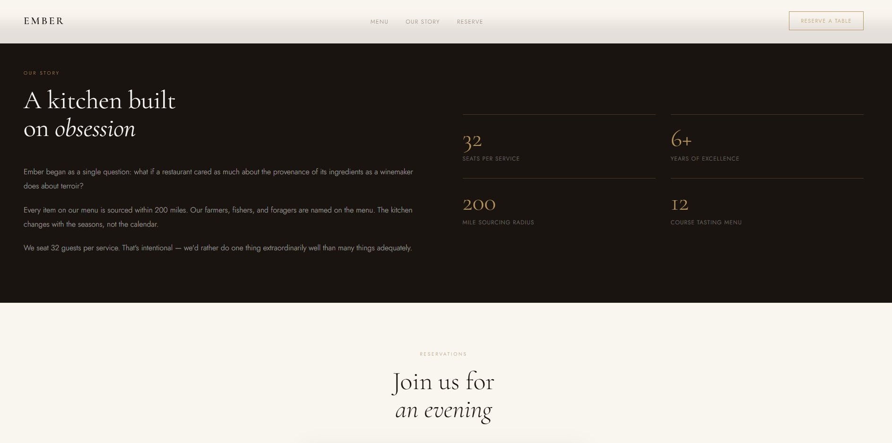

# Ember — Fine Dining Restaurant Landing Page

A refined, editorial landing page designed for a fine dining restaurant. Built around a dark, warm aesthetic with serif typography, smooth scroll animations, and a seasonal menu showcase.



---

## Live Demo

🔗 [johank-portfolio-restaurant.netlify.app](https://johank-portfolio-restaurant.netlify.app/)

---

## About

Ember is a concept landing page for an upscale restaurant targeting high-end diners. The goal was to communicate luxury, intimacy, and quality through design alone — before the visitor reads a single word. The split-screen hero, gold accents, and editorial typography do exactly that.

---

## Screenshots



---

## Features

- Split-screen hero with editorial serif typography
- Seasonal menu grid with dish descriptions and pricing
- Dark "Our Story" section with animated statistics
- Email reservation form
- Smooth scroll animations on all sections
- Fully responsive across all screen sizes

---

## Tech Stack

| Technology | Purpose |
|---|---|
| HTML5 | Structure and content |
| CSS3 | Styling, animations, layout |
| JavaScript | Scroll reveal, smooth navigation |
| Google Fonts | Cormorant Garamond + Jost typefaces |

---

## Getting Started

No installation needed. Just open the file in a browser.

```bash
git clone https://github.com/johank/restaurant-landing-page.git
open index.html
```

---

## Contact

Built by **Johan K**
📧 [johank.dev1@gmail.com](mailto:johank.dev1@gmail.com)
🌐 [johank.netlify.app](https://johank.netlify.app)
